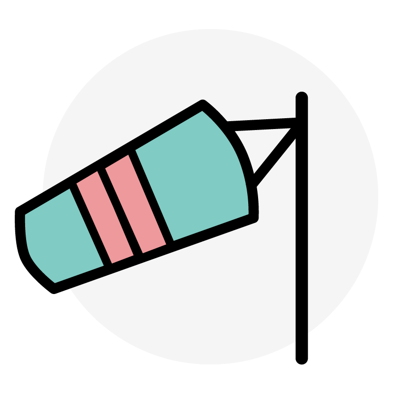

<h1 align="center">GATS - Modern web development, simplified.</h1>

    
    
    
    
GATS is an acronimus for
<a href="go.dev/">Go</a>/<a href="github.com/gin-gonic/gin">Gin</a>,
<a href="alpinejs.dev">Alpine.js</a>, 
<a href="twind.dev">Twind</a> and <a href="www.sqlite.org/">Sqlite</a>.

  <em>Less setup, more code</em>
   

### Requirements:
- [Golang](go.dev) installed.

### Get started:
